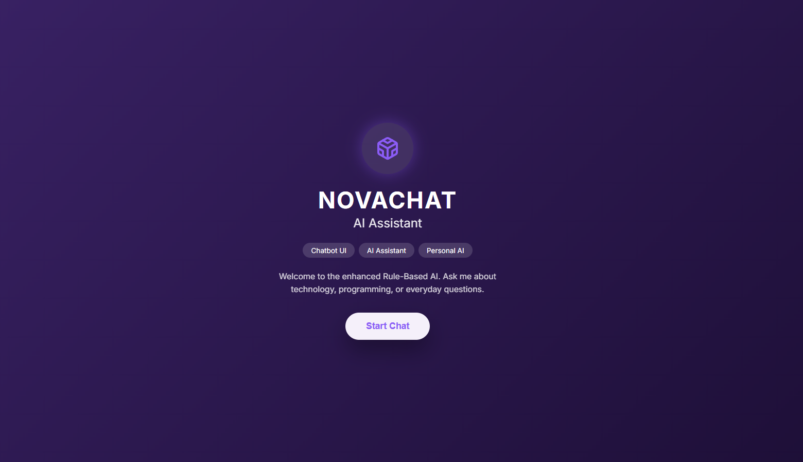
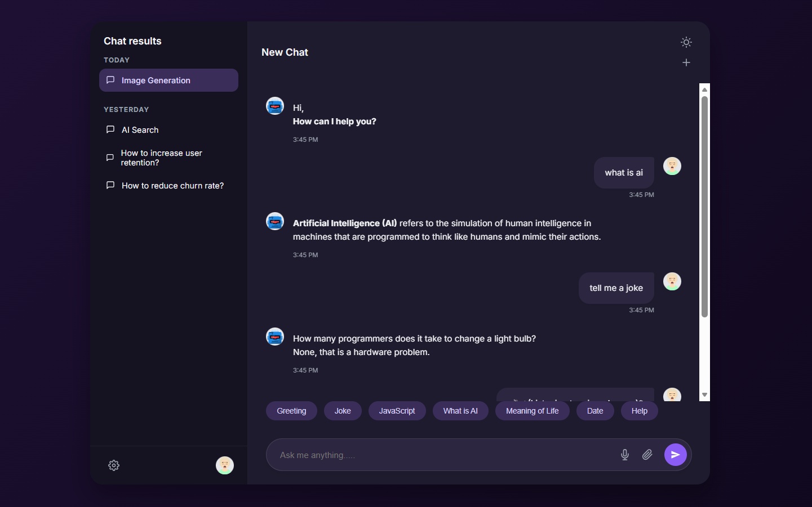

# NovaChat AI - Rule-Based Chatbot

**Project 1 - DecodeLabs Artificial Intelligence Internship**

## Project Overview

NovaChat AI is a rule-based chatbot developed as part of the DecodeLabs Artificial Intelligence Internship. The chatbot responds to predefined user inputs using conditional (`if-else`) decision-making logic. This project demonstrates the fundamentals of rule-based conversational systems and is implemented in two formats:

- **Web Application** using HTML, CSS, and JavaScript
- **Python Terminal Application** using Python

---

## Features

### Web Application

- Modern and responsive chatbot interface
- Professional UI with dark and light theme support
- Theme preference saved using `localStorage`
- Responsive sidebar with mobile-friendly navigation
- Quick action buttons for common chatbot commands
- Simulated microphone and file upload interface
- Smooth animations and interactive user experience

### Rule-Based Chatbot

The chatbot responds to predefined commands using rule-based logic.

Supported interactions include:

- Greetings (Hi, Hello, Good Morning, etc.)
- Basic conversation (How are you?, Tell me a joke, Meaning of life)
- Information queries (What is AI?, What is JavaScript?)
- Date and time
- Creator information
- Help menu
- Clear chat
- Exit commands (Bye, Exit, Quit)
- Default response for unknown inputs

---

## Technologies Used

- Python 3
- HTML5
- CSS3
- Vanilla JavaScript

---

## Project Structure

```text
Task-01-Rule-Based-AI-Chatbot/
│
├── index.html
├── style.css
├── script.js
├── chatbot.py
├── README.md
├── requirements.txt
└── screenshots/
```

---

## Installation and Usage

### Web Application

1. Navigate to the project folder.
2. Open `index.html` in any modern web browser.

Alternatively, run the project using the **Live Server** extension in Visual Studio Code for a better development experience.

### Python Application

1. Ensure Python 3.x is installed.
2. Open a terminal in the project directory.
3. Run the following command:

```bash
python chatbot.py
```

---

## Chatbot Capabilities

The chatbot supports the following commands:

| Category | Examples |
|----------|----------|
| Greetings | Hi, Hello, Hey, Good Morning |
| Conversation | How are you?, Tell me a joke |
| Information | What is AI?, What is JavaScript? |
| System | Date, Time, Who created you? |
| Utilities | Help, Clear |
| Exit | Bye, Exit, Quit |

---

## Screenshots

### Landing Page



### Chat Interface


### Help Menu


### Dark Mode



---

## Learning Outcomes

This project helped strengthen the following concepts:

- Rule-based chatbot development
- Decision-making using `if-else` conditions
- DOM manipulation with JavaScript
- Responsive web design using HTML and CSS
- Theme management using `localStorage`
- User input processing and string manipulation
- Building interactive web applications without external frameworks

---

## Future Enhancements

Potential improvements include:

- Voice recognition integration
- Chat history persistence
- Expanded knowledge base
- Natural Language Processing (NLP) support
- Backend integration with AI models

---

## Author

**Artificial Intelligence**

DecodeLabs Artificial Intelligence Internship – Project 1
