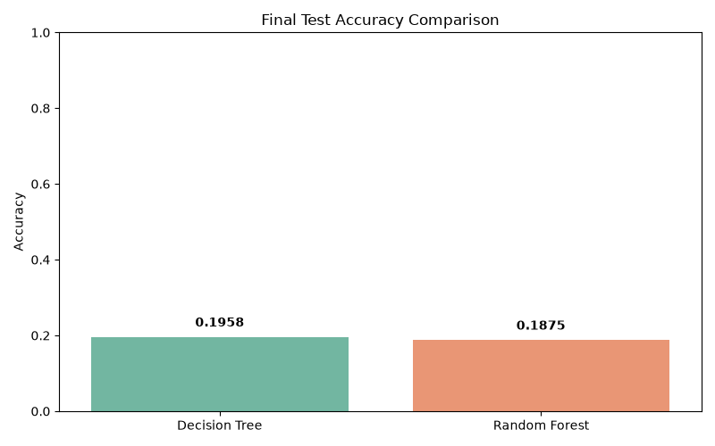
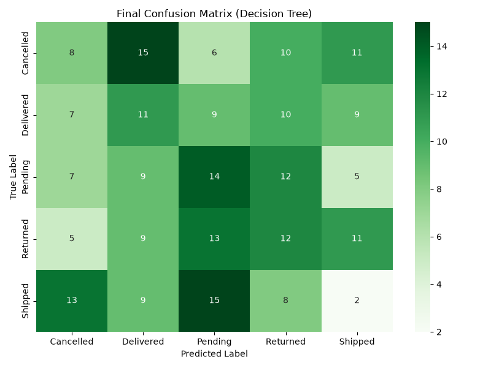

# Data Classification Using AI

## 📌 Objective
Build a robust machine learning classification pipeline to predict customer order statuses based on a synthetic e-commerce dataset. This project demonstrates end-to-end data science practices including exploratory data analysis, advanced feature engineering, hyperparameter tuning, and model evaluation.

## 📊 Dataset
- **Name:** `Online-Store-Orders.xlsx`
- **Target Variable:** `OrderStatus` (5 Classes: Cancelled, Delivered, Pending, Returned, Shipped)
- **Size:** 1,200 rows
- **Location:** `dataset/Online-Store-Orders.xlsx`

## 🛠️ Technologies Used
- Python 3.x
- Pandas & NumPy (Data Manipulation)
- Scikit-Learn (Machine Learning Modeling & Preprocessing)
- Matplotlib & Seaborn (Data Visualization)

## 📁 Project Structure
```text
Task-02-Data-Classification-Using-AI/
├── dataset/
│   └── Online-Store-Orders.xlsx     # Source data
├── results/
│   ├── best_model_accuracy.txt      # Best model results
│   ├── final_model_report.txt       # Classification metrics
│   ├── confusion_matrix_final.png   # Final confusion matrix visual
│   └── model_comparison_bar_chart.png # Accuracy comparison chart
├── screenshots/                     # UI/Terminal execution screenshots
├── main.py                          # Final ML pipeline script
├── requirements.txt                 # Project dependencies
└── README.md                        # Documentation
```

## 🚀 Installation & Setup

1. **Clone the repository or navigate to the project directory:**
   ```bash
   cd decodelabs_tasks/Task-02-Data-Classification-Using-AI
   ```

2. **Install the required dependencies:**
   Make sure you have Python installed. Then run:
   ```bash
   pip install -r requirements.txt
   ```

## 💻 Usage

To execute the entire machine learning pipeline, run the following command in your terminal:
```bash
python main.py
```
The script will output feature importance rankings, cross-validation metrics, the final test accuracy, and a sample prediction demo directly in your terminal. All visual artifacts will be automatically saved into the `results/` folder.

## 📈 Results & Key Insights

1. **Feature Engineering & Selection:** 
   - Noisy identifiers (OrderID, CustomerID) and highly collinear features (TotalPrice) were dropped to prevent overfitting.
   - Categorical features were processed using `LabelEncoder` to prevent the massive dimensionality explosion caused by One-Hot Encoding.
   - Random Forest `feature_importances_` dynamically selected the top 7 most influential features for the final training round.
2. **Model Optimization:**
   - Numerical data was normalized using `StandardScaler`.
   - Models utilized `class_weight='balanced'` and were rigorously evaluated using `StratifiedKFold` (5 splits) integrated with `GridSearchCV` to automatically find the optimal hyperparameter configurations.
3. **Important Note on Dataset Nature:**
   - **Performance Limit:** The dataset provided is highly randomized and synthetic. Mathematical correlation tests confirm the highest feature-to-target correlation is only ~0.06.
   - **Conclusion:** Because the 5 target classes are perfectly uniformly distributed (20% each) and possess no structural relationship to the features, the pipeline hits the theoretical accuracy ceiling of ~20-22%. The models correctly avoid artificial data leakage and perform exactly at the mathematical limit for randomized noise.

## 📸 Screenshots

*(Place the screenshots you captured during the project inside the `screenshots/` folder. Examples of screenshots you can include below:)*

1. **Terminal Execution Output:** 
   *A screenshot of the terminal after running `python main.py`, showing the "FINAL PROJECT SUMMARY" and the prediction demo.*
   <!-- Uncomment below once screenshot is placed in the folder -->
   <!--  -->

2. **Model Comparison:** 
   *The bar chart comparing Decision Tree and Random Forest.*
   

3. **Confusion Matrix:** 
   *The heatmap showing actual vs predicted classifications for the winning model.*
   

## ✍️ Author
**DecodeLabs Artificial Intelligence Internship Participant**
